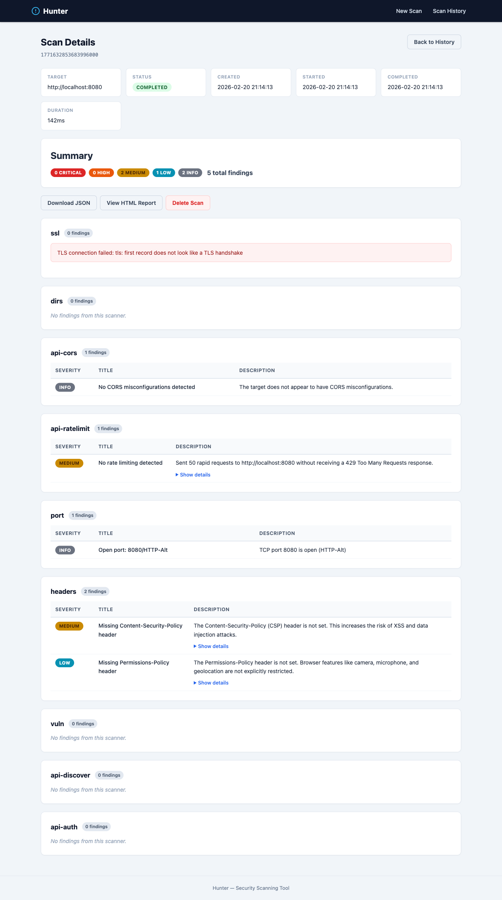

# Hunter

Hunter is a CLI tool designed for developers that performs pentests as an ethical hacker aiming to find bugs, vulnerabilities, security issues, breaches, and much more in their apps.

## Installation

```bash
go install github.com/buemura/hunter/cmd/hunter@latest
```

> **Note:** Make sure `$GOPATH/bin` is in your `PATH`. If you get `command not found: hunter` after installing, run:
>
> ```bash
> echo 'export PATH=$PATH:$(go env GOPATH)/bin' >> ~/.zshrc
> source ~/.zshrc
> ```

Or build from source:

```bash
git clone https://github.com/buemura/hunter.git
cd hunter
make build
```

## Quick Start

Scan for open ports on a target:

```bash
hunter scan port -t example.com
```

Scan specific ports with JSON output:

```bash
hunter scan port -t 192.168.1.1 --ports 22,80,443,8080 -o json
```

Scan a port range:

```bash
hunter scan port -t example.com --ports 1-1024
```

## Web Mode

Start the web interface to run scans from a browser:

```bash
hunter serve --addr :8080
```

You can specify any port:

```bash
hunter serve --addr :3000
```

Open `http://localhost:<port>` to access the web interface. From there you can configure scan targets, select scanners, and view results with severity breakdowns and remediation tips.


Scan results show a severity breakdown with detailed findings per scanner:



The REST API is also available at `/api/v1/scans` for programmatic access.

## Commands

| Command | Description |
|---------|-------------|
| `hunter scan port` | TCP port scanning |
| `hunter serve` | Start the web server |
| `hunter version` | Print version info |

### Global Flags

| Flag | Short | Default | Description |
|------|-------|---------|-------------|
| `--target` | `-t` | | Target host, IP, or URL |
| `--output` | `-o` | `table` | Output format: `table`, `json` |
| `--verbose` | `-v` | `false` | Verbose output |
| `--concurrency` | `-c` | `10` | Max concurrent operations |
| `--timeout` | | `5s` | Connection timeout |

## Development

```bash
make build    # Build binary to bin/hunter
make test     # Run all tests
make lint     # Run linters
make clean    # Remove build artifacts
```

## Architecture

See [docs/architecture.md](docs/architecture.md) for details on the scanner plugin architecture and how to add new modules.
